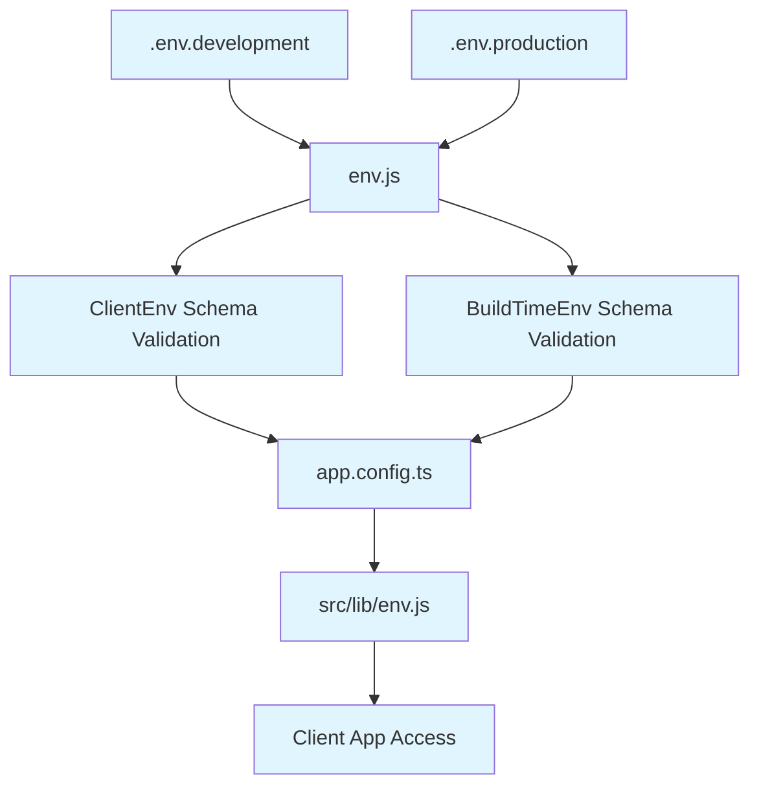

# twheo-expo-template

This template is designed for solo developers and small projects, focusing on **maximum speed** and **minimum boilerplate**.

It is based on the proven architecture of [obytes](https://github.com/obytes/react-native-template-obytes), but is stripped down to its essentials. The goal is to provide a clean foundation, letting you concentrate solely on building your core product.

## Environment Variables Management

This template provides a robust system for managing environment variables, ensuring complete separation between **development** and **production** configurations, along with strict **type safety** and **validation**.



- **Separation**: Development and production environments are fully isolated.
- **Type Safety**: Uses Zod for schema validation of both client and build-time variables.
- **Centralized Control**: `env.js` handles validation, parsing, and distribution.
- **Client Access**: `src/lib/env.js` offers a clean interface for client-side variables.
- **Build Integration**: Variables are injected into Expo's build configuration via `app.config.ts`.

## File Structure

This template adopts a **Domain-Driven** folder structure to maximize **scalability, maintainability, and development velocity**.

The conventional **"Folder-by-Type"** structure often suffers from:
1. Difficulty navigating code, as files from different domains are mixed.
2. Logic fragmentation, scattering domain-specific code across the codebase.

The **Domain-Driven** approach solves this by providing:

- **High Cohesion**: Related code (API, hooks, components) is co-located within a single domain folder (e.g., `features/product`).
- **Low Coupling**: Modules are independent, making features easy to modify or delete.
- **Clear Separation of Concerns**: Distinction between business logic (`features/`), pure UI (`components/`), and page assembly (`screens/`).
- **Easy Navigation**: All code for a specific domain is found in one place.

```
├── assets/
├── app/ # Routing Layer (Expo Router)
│ ├── \_layout.tsx
│ ├── index.tsx # Renders src/screens/HomeScreen.tsx
│ ├── (tabs)/
│ │ ├── \_layout.tsx
│ │ ├── dashboard.tsx # Renders src/screens/DashboardScreen.tsx
│ │ └── settings.tsx # Renders src/screens/SettingsScreen.tsx
│ └── product/
│ └── [id].tsx # Renders src/screens/ProductDetailScreen.tsx
│
├── src/
│ ├── features/ # Domain Logic (Core)
│ │ ├── user/
│ │ │ ├── useUserQuery.ts
│ │ │ ├── UserProfileWidget.tsx
│ │ │ ├── useAuth.ts
│ │ │ └── types.ts
│ │ │
│ │ ├── product/ # Use sub-folders as the domain grows
│ │ │ ├── api/
│ │ │ ├── components/
│ │ │ ├── hooks/
│ │ │ └── types.ts
│ │ │
│ │ └── (another-domain)/
│ │
│ ├── screens/ # Page Assembly Layer
│ │ ├── HomeScreen.tsx
│ │ └── (Other screens...)
│ │
│ ├── components/ # Pure, Shared UI (Domain-Agnostic)
│ │ ├── ui/
│ │ │ ├── Button.tsx, Input.tsx, Modal.tsx, Card.tsx
│ │ ├── layout/
│ │ └── (forms, feedback, etc.)
│ │
│ ├── lib/ # Shared Utilities
│ │ └── (constants, utils, api, etc.)
│ │
│ ├── hooks/ # Shared Hooks (Domain-Agnostic)
│ │ └── (useDebounce, useAppState, useTheme, etc.)
│ │
│ └── store/ # Shared State (Domain-Agnostic)
│ └── uiStore.ts # (Theme, modal state, etc.)
```

- **`app/`**: **Role:** Manages routing configuration exclusively.
- **`features/`**: **Role:** Contains core business logic, organized by domain. Complexity allows for flexible sub-folder organization (`components/`, `api/`, etc.).
- **`screens/`**: **Role:** Assembles components from `features/` to create a specific page. This layer separates routing (`app/`) from page implementation, adhering to the Single Responsibility Principle.
- **`components/`**: **Role:** Contains only pure, domain-agnostic UI components. This principle of shared, domain-agnostic logic also applies to `lib/`, `hooks/`, and `store/`.
